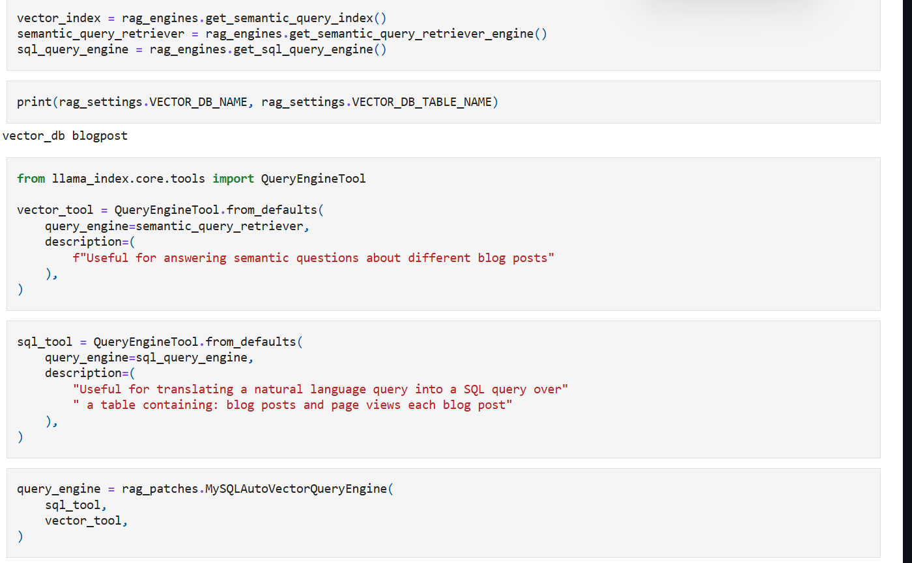
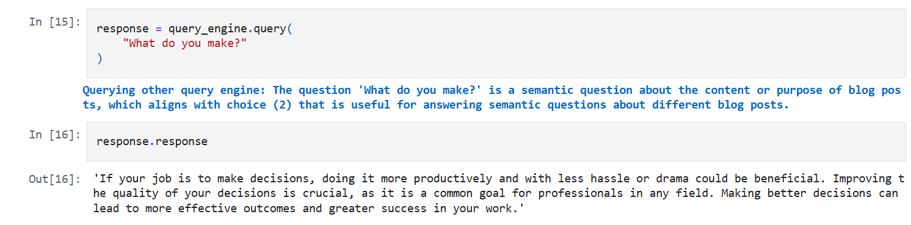
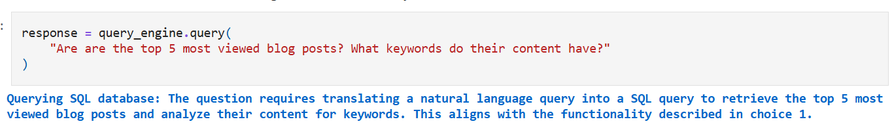
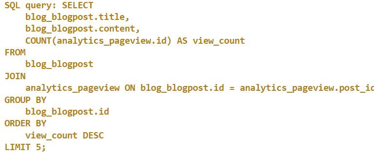
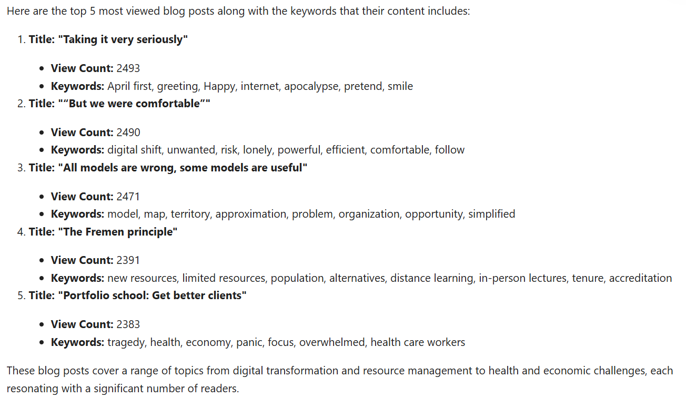

# Talk to Django

**Natural Language to SQL + RAG for Django**

this is a system that enables querying a Django-backed database using **natural language**. It combines Retrieval‑Augmented Generation (RAG), embeddings, and Large Language Models (LLMs) to translate user intent into accurate, executable SQL queries.

This project is designed for conversational analytics, internal dashboards, admin tooling, and data exploration without requiring users to write SQL.

---

## 1. Core Objective

The primary goal of this project is to:

* Translate **natural language questions** into **safe and correct SQL**
* Ground SQL generation in **real schema context** using RAG
* Execute queries against a Django-managed database
* Return structured, interpretable results

---

## 2. Key Features

* Natural Language → SQL translation
* Retrieval‑Augmented Generation (RAG)
* Embedding-based schema and context search
* Django ORM / SQL database integration
* Modular pipeline (retrieval, generation, execution)


---

## 3. High-Level Workflow

### Step 1: User Query Input

The user submits a query in natural language, for example:

> "Show monthly revenue growth for the last year"

---

### Step 2: Query Understanding & Embedding

* The natural language query is converted into a **vector embedding**
* This embedding represents the semantic meaning of the query

---

### Step 3: Context Retrieval (RAG)

* The embedding is used to perform a **similarity search** against a vector store
* Retrieved documents may include:

  * Database schema descriptions
  * Table and column metadata
  * Example SQL queries
  * Business logic notes

This step ensures the LLM is grounded in **real, relevant context**, reducing hallucinations.

---

### Step 4: Prompt Construction

A structured prompt is assembled containing:

* The original user question
* Retrieved schema/context documents
* SQL generation rules and constraints

This prompt acts as a contract between the system and the LLM.

---

### Step 5: SQL Generation (LLM)

* The LLM generates a SQL query based on the provided prompt
* The output is constrained to:

  * Valid SQL
  * Known tables and columns
  * Read-only operations (SELECT)

---

### Step 6: SQL Validation & Safety Layer

Before execution, the SQL is:

* Parsed and validated
* Checked for disallowed operations (DROP, DELETE, UPDATE)
* Verified against known schema

Invalid or unsafe queries are rejected or regenerated.

---

### Step 7: Query Execution

* The validated SQL is executed against the database
* Execution is performed via Django’s database connection or raw SQL engine

---

### Step 8: Response Formatting

* Results are formatted into JSON or tabular structures
* Returned to the client or frontend

---

## 4. Internal Architecture

```
User Query
   ↓
Embedding Model
   ↓
Vector Store (RAG)
   ↓
Context Retrieval
   ↓
Prompt Builder
   ↓
LLM (SQL Generation)
   ↓
SQL Validator
   ↓
Database Execution
   ↓
Formatted Response
```

---

## 5. Project Structure (Conceptual)

```
NL-to-SQl--Rag/
├── src/
│   ├── rag/                 # Retrieval and embedding logic
│   ├── sql_generation/      # Prompting and SQL generation
│   ├── validation/          # SQL safety and validation
│   ├── execution/           # Database execution layer
│   └── api/                 # Django / API endpoints
├── .env.sample
├── requirements.txt
└── README.md
```

---

## 6. Design Decisions

### Why RAG?

Pure LLM-based SQL generation often fails due to:

* Schema hallucinations
* Incorrect joins
* Missing business constraints

RAG ensures that SQL generation is **context-aware and schema-grounded**.

---

### Why Embeddings?

Embeddings allow:

* Semantic matching (not keyword-based)
* Robust handling of paraphrased queries
* Scalable retrieval over large schemas

---

## 7.## 7. Planned Extension: Multimodal RAG (Design Proposal)

### 7.1 Motivation

Many real-world search queries include **visual context**, such as:

* Screenshots of dashboards
* Photos of charts or tables
* Images containing text or UI elements

To handle this, the system can be extended into a **multimodal RAG pipeline**.

---

### 7.2 Proposed Multimodal Workflow

#### Step 1: Image Ingestion

* User submits an image along with a natural language query
* Example:

  > "Why does this chart show a drop in sales?" + image

---

#### Step 2: Image Understanding

* Apply OCR to extract text from images (tables, labels, axes)
* Use a vision-language model to summarize visual elements

---

#### Step 3: Image-to-Text Embeddings

* Convert extracted image information into embeddings
* Store alongside schema and text embeddings in the vector store

---

#### Step 4: Unified Retrieval

* Perform retrieval across:

  * Schema documents
  * SQL examples
  * Image-derived documents

This creates a **shared semantic search space**.

---

#### Step 5: Multimodal Prompting

The prompt includes:

* User question
* Retrieved schema context
* Extracted image insights

The LLM reasons across **text + visual context**.

---

## 8. Notes on Improving Accuracy & Robustness

### 8.1 Schema-Aware Chunking

* Split schema into logical chunks (per table or domain)
* Improves retrieval precision

---

### 8.2 SQL Feedback Loop

* If execution fails, feed the error back to the LLM
* Allow automatic SQL regeneration

---

### 8.3 Query Intent Classification

Classify queries into:

* Aggregation
* Time-series analysis
* Ranking / filtering
* Comparison

Use intent to guide SQL templates.

---

### 8.4 Caching & Query Memory

* Cache successful NL → SQL mappings
* Reuse SQL for repeated or similar queries

---

### 8.5 Security Hardening

* Enforce read-only DB users
* Apply row-level access controls
* Add user-based query constraints

---

## 9. Future Enhancements

* Conversational memory (multi-turn queries)
* Role-aware query permissions
* Auto-generated visualizations
* Full-text + structured hybrid search
* Production-grade observability and logging

---

## 10.Examples

Below are detailed examples showcasing the full capabilities of the NL-to-SQL + RAG system, highlighting the end-to-end workflow from natural language input to actionable query results. Each notebook is linked using Markdown for easy access.

[Open Demo Notebook](Demos/99%20-%20Demo.ipynb) to see an example of some queries related to post and theire data and other type of question  and you can test .

### 10.Custom Query Engine:

since the demo handles posts wich invoke a problem if the question inolves sementic operation so we used a custom Engine that takes two other query engines and used them as tools then determine the query engine tool thats suitable to answer the query, the first is Text to Sql queryengine tool and the other is sementic query retreiver,the full implementation is in the rag module in detail.




the first example the user asks "what do you make " wich doesnt require any sql generation or queriying ,as demonstrated below it first it deside wich tool has to use and he chose the right one 



then the response is the closest post in meaning to the query so he used the sementic retreiver 


the second example and third  shows analyticl query wich require sql quering ,so the first step is to anlyze the query the task then descide wich query Engine tool that he will use.


as it has been shown it decided the Sql QueryEnginetool then it generate the necessary sql based on the database schemas wich are provided.




after sql execution and documents retreival the finalize answer is as follow : 




in the next part will explain in detail  the SqlQueryEngine and How it works 